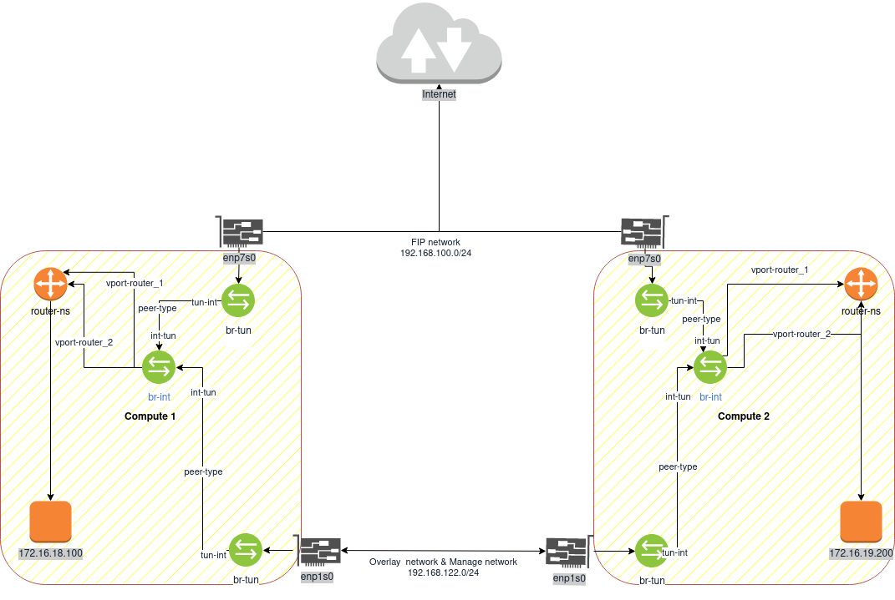

# Topology

## 2 Network,2 Host,1 Fip


# Walkthrough

## Host 1

#### create br host
- `ovs-vsctl add-br br-tun`
- `ovs-vsctl add-port br-tun vxlan1 -- set interface vxlan1 type=vxlan options:remote_ip=192.168.122.33 options:local_ip=192.168.122.7 options:egress_pkt_mark=0 options:df_default=true options:out_key=flow options:in_key=flow`
- `ovs-vsctl set br br-tun fail_mode=secure`

#### create ex br
- `ovs-vsctl add-br br-ex`
- `ovs-vsctl set br br-ex fail_mode=secure`

#### add nic fip to Ovs
- `ovs-vsctl add-port br-ex enp7s0`
- `ifconfig enp7s0 up`

#### create int-br
- `ovs-vsctl add-br br-int`
- `ovs-vsctl set br br-int fail_mode=secure`

#### create port for patch type 
- `ovs-vsctl add-port br-int int-ex -- set interface int-ex type=patch options:peer=ex-int`
- `ovs-vsctl add-port br-ex ex-int -- set interface ex-int type=patch options:peer=int-ex`
- `ovs-vsctl add-port br-int int-tun -- set interface int-tun type=patch options:peer=tun-int`
- `ovs-vsctl add-port br-tun tun-int -- set interface tun-int type=patch options:peer=int-tun`

#### create fip & router port in int-br
- `ovs-vsctl add-port br-int v-fip tag=3 -- set interface v-fip type=internal`
- `ovs-vsctl add-port br-int v-router_1 tag=10 -- set interface v-router_1 type=internal`
- `ovs-vsctl add-port br-int v-router_2 tag=20 -- set interface v-router_2 type=internal`

#### create fip & router ns
- `ip netns add fip-ns`
- `ip netns add router-ns`

#### add vport fip&router to ns
- `ip link set v-fip netns fip-ns`
- `ip link set v-router_1 netns router-ns`
- `ip link set v-router_2 netns router-ns`

#### add ip in fip-ns
- `ip netns exec fip-ns ip add add 192.168.100.254/24 dev v-fip`
- `ip netns exec fip-ns ip link set v-fip up`
- `ip netns exec fip-ns ip route add default via 192.168.100.1 dev v-fip`

#### add link from fip to router
- `ip link add fpr netns fip-ns type veth peer name rfp netns router-ns`

#### enable arp proxy
- `ip netns exec fip-ns sysctl net.ipv4.conf.v-fip.proxy_arp=1`

#### add ip in router-ns
- `ip netns exec router-ns ip add add 172.16.18.1/24 dev v-router_1`
- `ip netns exec router-ns ip add add 172.16.19.1/24 dev v-router_2`
- `ip netns exec router-ns ip link set v-router_1 address 00:00:00:00:01:0f`
- `ip netns exec router-ns ip link set v-router_2 address 00:00:00:00:02:0f`
- `ip netns exec router-ns ip link set v-router_1 up`
- `ip netns exec router-ns ip link set v-router_2 up`
- `ip netns exec router-ns ip neighbor replace 172.16.18.100 lladdr 00:00:00:00:01:01 nud permanent dev v-router_1`
- `ip netns exec router-ns ip neighbor replace 172.16.19.200 lladdr 00:00:00:00:02:02 nud permanent dev v-router_2`
- `ip netns exec router-ns sysctl -w net.ipv4.ip_forward=1`

#### add ip in rfp
- `ip netns exec router-ns ip add add 169.254.31.238/31 dev rfp`
- `ip netns exec router-ns ip link set rfp up`

#### add ip in fpr
- `ip netns exec fip-ns ip add add 169.254.31.239/31 dev fpr`
- `ip netns exec fip-ns ip link set fpr up`
- `ip netns exec fip-ns ip route add 192.168.100.150 via 169.254.31.238 dev fpr`
- ~~`ip netns exec fip-ns ip route add 192.168.100.160 via 169.254.31.238 dev fpr`~~
- ~~`ip netns exec fip-ns ip route add 192.168.100.170 via 169.254.31.238 dev fpr`~~
- ~~`ip netns exec fip-ns ip route add 192.168.100.180 via 169.254.31.238 dev fpr`~~

#### set ip route router-ns
- ~~`ip netns exec router-ns ip route add default via 169.254.31.239 dev rfp`~~
- `ip netns exec router-ns ip route add default via 169.254.31.239 dev rfp table 2525`
- `ip netns exec router-ns ip rule add from 172.16.18.100 lookup 2525 priority 42766`

- `ip netns exec router-ns ip route add default dev v-router_1 table 5252`
- `ip netns exec router-ns ip rule add from 172.16.18.0/24 lookup 5252 priority 627660`


#### set nat firewall

###### add new chains
- `ip netns exec router-ns iptables -t nat -N humanz-neutron-OUTPUT`
- `ip netns exec router-ns iptables -t nat -N humanz-neutron-POSTROUTING `
- `ip netns exec router-ns iptables -t nat -N humanz-neutron-PREROUTING `
- `ip netns exec router-ns iptables -t nat -N humanz-neutron-float-snat`
- `ip netns exec router-ns iptables -t nat -N humanz-neutron-snat`
- `ip netns exec router-ns iptables -t nat -N neutron-postrouting-bottom`
###### set PREROUTING,OUTPUT,POSTROUTING jump to new chains
- `ip netns exec router-ns iptables -t nat -A PREROUTING -j humanz-neutron-PREROUTING`
- `ip netns exec router-ns iptables -t nat -A OUTPUT -j humanz-neutron-OUTPUT`
- `ip netns exec router-ns iptables -t nat -A POSTROUTING -j humanz-neutron-POSTROUTING `
- `ip netns exec router-ns iptables -t nat -A POSTROUTING -j neutron-postrouting-bottom`
##### set DNAT&SNAT
- `ip netns exec router-ns iptables -t nat -A humanz-neutron-OUTPUT -d 192.168.100.150/32 -j DNAT --to-destination 172.16.18.100`
- `ip netns exec router-ns iptables -t nat -A humanz-neutron-POSTROUTING ! -i rfp ! -o rfp -m conntrack ! --ctstate DNAT -j ACCEPT`
- `ip netns exec router-ns iptables -t nat -A humanz-neutron-PREROUTING -d 192.168.100.150/32 -j DNAT --to-destination 172.16.18.100`
- `ip netns exec router-ns iptables -t nat -A humanz-neutron-float-snat -s 172.16.18.100/32 -j SNAT --to-source 192.168.100.150`
- `ip netns exec router-ns iptables -t nat -A humanz-neutron-snat -j humanz-neutron-float-snat`
- `ip netns exec router-ns iptables -t nat -A neutron-postrouting-bottom -m comment --comment "Perform source NAT on outgoing traffic." -j humanz-neutron-snat`

#### set dhcp server
- `ovs-vsctl add-port br-int v-dhcp_1 tag=10 -- set interface v-dhcp_1 type=internal`
- `ovs-vsctl add-port br-int v-dhcp_2 tag=20 -- set interface v-dhcp_2 type=internal`

- `ip netns add dhcp-1-ns`
- `ip netns add dhcp-2-ns`
- `ip link set v-dhcp_1 netns dhcp-1-ns`
- `ip link set v-dhcp_2 netns dhcp-2-ns`

- `ip netns exec dhcp-1-ns ip add add 172.16.18.2/24 dev v-dhcp_1`
- `ip netns exec dhcp-2-ns ip add add 172.16.19.2/24 dev v-dhcp_2`

- `ip netns exec dhcp-1-ns ip link set v-dhcp_1 up`
- `ip netns exec dhcp-2-ns ip link set v-dhcp_2 up`

- `ip netns exec dhcp-1-ns dnsmasq -p0 --dhcp-range=172.16.18.10,172.16.18.253,1h --dhcp-option=3,172.16.18.1 --dhcp-host=00:00:00:00:01:01,172.16.18.100 --dhcp-host=00:00:00:00:02:01,172.16.18.200 --dhcp-leasefile=/var/lib/misc/dhcp-1-dnsmasq.leases`
- `ip netns exec dhcp-2-ns dnsmasq -p0 --dhcp-range=172.16.19.10,172.16.19.253,1h --dhcp-option=3,172.16.19.1 --dhcp-host=00:00:00:00:01:02,172.16.19.100 --dhcp-host=00:00:00:00:02:02,172.16.19.200 --dhcp-leasefile=/var/lib/misc/dhcp-2-dnsmasq.leases`

#### set openflow

#### ex
- `ovs-ofctl add-flow br-ex "table=0,priority=4,in_port=2,dl_vlan=3 actions=strip_vlan,NORMAL"`### in_port="ex-int"
- `ovs-ofctl add-flow br-ex "table=0,priority=2,in_port=2 actions=resubmit(,1)"` ### in_port="ex-int"
- `ovs-ofctl add-flow br-ex "table=0,priority=0 actions=NORMAL"`
- `ovs-ofctl add-flow br-ex "table=0,priority=1 actions=resubmit(,3)"`
- `ovs-ofctl add-flow br-ex "table=1,priority=0 actions=resubmit(,2)"`
- `ovs-ofctl add-flow br-ex "table=2,priority=2,in_port=2 actions=drop"`
- `ovs-ofctl add-flow br-ex "table=3,priority=1 actions=NORMAL"`

#### int 
- `ovs-ofctl add-flow br-int "table=0,priority=2,in_port=1,vlan_tci=0x0000/0x1fff,actions=mod_vlan_vid:3,resubmit(,60)"` ### in_port="int-ex"
- `ovs-ofctl add-flow br-int "table=0,priority=4 dl_src=00:00:00:00:02:1e,actions=resubmit(,1)"`
- `ovs-ofctl add-flow br-int "table=0,priority=0 actions=resubmit(,60)"`
- `ovs-ofctl add-flow br-int "table=1,priority=4 dl_dst=00:00:00:00:01:01 actions=strip_vlan,mod_dl_src:00:00:00:00:01:0f,output:8"` ### output:vnet0
- `ovs-ofctl add-flow br-int "table=60,priority=3 actions=NORMAL"`

#### tun
- `ovs-ofctl add-flow br-tun "table=0,priority=1,in_port=2 actions=resubmit(,1)"` ### in_port="tun-int"
- `ovs-ofctl add-flow br-tun "table=0,priority=1,in_port=1 actions=resubmit(,4)"` ### in_port="tun-int"
- `ovs-ofctl add-flow br-tun "table=0,priority=0 actions=drop"`

- `ovs-ofctl add-flow br-tun "table=1,priority=10,arp,dl_vlan=10,arp_tpa=172.16.18.1 actions=drop"`
- `ovs-ofctl add-flow br-tun "table=1,priority=10,arp,dl_vlan=20,arp_tpa=172.16.19.1 actions=drop"`
- `ovs-ofctl add-flow br-tun "table=1,priority=10,arp,dl_vlan=10,dl_dst=00:00:00:00:01:0f actions=drop"`
- `ovs-ofctl add-flow br-tun "table=1,priority=10,arp,dl_vlan=20,dl_dst=00:00:00:00:02:0f actions=drop"`
- `ovs-ofctl add-flow br-tun "table=1,priority=5,dl_vlan=10,arp,actions=resubmit(,2)"`
- `ovs-ofctl add-flow br-tun "table=1,priority=5,dl_vlan=20,arp,actions=resubmit(,2)"`
- `ovs-ofctl add-flow br-tun "table=1,priority=4,dl_vlan=10,dl_src=00:00:00:00:01:0f actions=mod_dl_src:00:00:00:00:01:1e,resubmit(,2)"`
- `ovs-ofctl add-flow br-tun "table=1,priority=4,dl_vlan=20,dl_src=00:00:00:00:02:0f actions=mod_dl_src:00:00:00:00:01:1e,resubmit(,2)"`
- `ovs-ofctl add-flow br-tun "table=1,priority=0 actions=resubmit(,2)"`

- `ovs-ofctl add-flow br-tun "table=2,priority=5,arp,dl_dst=ff:ff:ff:ff:ff:ff actions=resubmit(,21)"`
- `ovs-ofctl add-flow br-tun "table=2,priority=0,dl_dst=00:00:00:00:00:00/01:00:00:00:00:00 actions=resubmit(,20)"`
- `ovs-ofctl add-flow br-tun "table=2,priority=0,dl_dst=01:00:00:00:00:00/01:00:00:00:00:00 actions=resubmit(,22)"`
- `ovs-ofctl add-flow br-tun "table=4,priority=1,tunnel_id=0x2 actions=mod_vlan_vid:10,resubmit(,9)"`
- `ovs-ofctl add-flow br-tun "table=4,priority=1,tunnel_id=0x3 actions=mod_vlan_vid:20,resubmit(,9)"`
- `ovs-ofctl add-flow br-tun "table=4,priority=0 actions=drop"`

- `ovs-ofctl add-flow br-tun "table=9,priority=0 actions=resubmit(,10)"`
- `ovs-ofctl add-flow br-tun "table=10,priority=1 actions=learn(table=20,hard_timeout=300,priority=1,cookie=0x0,NXM_OF_VLAN_TCI[0..11],NXM_OF_ETH_DST[]=NXM_OF_ETH_SRC[],load:0->NXM_OF_VLAN_TCI[],load:NXM_NX_TUN_ID[]->NXM_NX_TUN_ID[],output:OXM_OF_IN_PORT[]),output:2"` ### output:"tun-int"
- `ovs-ofctl add-flow br-tun "table=20,priority=0 actions=resubmit(,22)"`

- `ovs-ofctl add-flow br-tun "table=21,priority=1,arp,dl_vlan=10,arp_tpa=172.16.18.1 actions=move:NXM_OF_ETH_SRC[]->NXM_OF_ETH_DST[],mod_dl_src:00:00:00:00:01:0f,load:0x2->NXM_OF_ARP_OP[],move:NXM_NX_ARP_SHA[]->NXM_NX_ARP_THA[],move:NXM_OF_ARP_SPA[]->NXM_OF_ARP_TPA[],load:0x00000000010f->NXM_NX_ARP_SHA[],load:0xac101201->NXM_OF_ARP_SPA[],IN_PORT"`
- `ovs-ofctl add-flow br-tun "table=21,priority=1,arp,dl_vlan=10,arp_tpa=172.16.18.100 actions=move:NXM_OF_ETH_SRC[]->NXM_OF_ETH_DST[],mod_dl_src:00:00:00:00:01:01,load:0x2->NXM_OF_ARP_OP[],move:NXM_NX_ARP_SHA[]->NXM_NX_ARP_THA[],move:NXM_OF_ARP_SPA[]->NXM_OF_ARP_TPA[],load:0x000000000101->NXM_NX_ARP_SHA[],load:0xac101264->NXM_OF_ARP_SPA[],IN_PORT"`
- `ovs-ofctl add-flow br-tun "table=21,priority=1,arp,dl_vlan=10,arp_tpa=172.16.18.200 actions=move:NXM_OF_ETH_SRC[]->NXM_OF_ETH_DST[],mod_dl_src:00:00:00:00:02:01,load:0x2->NXM_OF_ARP_OP[],move:NXM_NX_ARP_SHA[]->NXM_NX_ARP_THA[],move:NXM_OF_ARP_SPA[]->NXM_OF_ARP_TPA[],load:0x000000000201->NXM_NX_ARP_SHA[],load:0xac1012c8->NXM_OF_ARP_SPA[],IN_PORT"`
- `ovs-ofctl add-flow br-tun "table=21,priority=1,arp,dl_vlan=20,arp_tpa=172.16.19.1 actions=move:NXM_OF_ETH_SRC[]->NXM_OF_ETH_DST[],mod_dl_src:00:00:00:00:02:0f,load:0x2->NXM_OF_ARP_OP[],move:NXM_NX_ARP_SHA[]->NXM_NX_ARP_THA[],move:NXM_OF_ARP_SPA[]->NXM_OF_ARP_TPA[],load:0x00000000020f->NXM_NX_ARP_SHA[],load:0xac101301->NXM_OF_ARP_SPA[],IN_PORT"`
- `ovs-ofctl add-flow br-tun "table=21,priority=1,arp,dl_vlan=20,arp_tpa=172.16.19.100 actions=move:NXM_OF_ETH_SRC[]->NXM_OF_ETH_DST[],mod_dl_src:00:00:00:00:01:02,load:0x2->NXM_OF_ARP_OP[],move:NXM_NX_ARP_SHA[]->NXM_NX_ARP_THA[],move:NXM_OF_ARP_SPA[]->NXM_OF_ARP_TPA[],load:0x000000000102->NXM_NX_ARP_SHA[],load:0xac101364->NXM_OF_ARP_SPA[],IN_PORT"`
- `ovs-ofctl add-flow br-tun "table=21,priority=1,arp,dl_vlan=20,arp_tpa=172.16.19.200 actions=move:NXM_OF_ETH_SRC[]->NXM_OF_ETH_DST[],mod_dl_src:00:00:00:00:02:02,load:0x2->NXM_OF_ARP_OP[],move:NXM_NX_ARP_SHA[]->NXM_NX_ARP_THA[],move:NXM_OF_ARP_SPA[]->NXM_OF_ARP_TPA[],load:0x000000000202->NXM_NX_ARP_SHA[],load:0xac1013c8->NXM_OF_ARP_SPA[],IN_PORT"`
- `ovs-ofctl add-flow br-tun "table=21,priority=0 actions=resubmit(,22)"`

- `ovs-ofctl add-flow br-tun "table=22,priority=1,dl_vlan=10 actions=strip_vlan,load:0x2->NXM_NX_TUN_ID[],output:1"` ### output:vxlan1
- `ovs-ofctl add-flow br-tun "table=22,priority=1,dl_vlan=20 actions=strip_vlan,load:0x3->NXM_NX_TUN_ID[],output:1"` ### output:vxlan1
- `ovs-ofctl add-flow br-tun "table=22,priority=0 actions=drop"`

### VMS
```
virt-install --import --name cirros-vm-1 --memory 512 --vcpus 1 --cpu host \
     --disk cirros-0.3.2-x86_64-disk.img,format=qcow2,bus=virtio \
     -w bridge=br-int,virtualport_type=openvswitch --mac=00:00:00:00:01:01 --check all=off
```
- `ovs-vsctl set port vnet0 tag=10`

## Host 2

#### create br host
- `ovs-vsctl add-br br-tun`
- `ovs-vsctl add-port br-tun vxlan1 -- set interface vxlan1 type=vxlan options:remote_ip=192.168.122.7 options:local_ip=192.168.122.33 options:egress_pkt_mark=0 options:df_default=true options:out_key=flow options:in_key=flow`
- `ovs-vsctl set br br-tun fail_mode=secure`

#### create ex br
- `ovs-vsctl add-br br-ex`
- `ovs-vsctl set br br-ex fail_mode=secure`

#### add nic fip to Ovs
- `ovs-vsctl add-port br-ex enp7s0`
- `ifconfig enp7s0 up`

#### create int-br
- `ovs-vsctl add-br br-int`
- `ovs-vsctl set br br-int fail_mode=secure`

#### create port for patch type 
- `ovs-vsctl add-port br-int int-ex -- set interface int-ex type=patch options:peer=ex-int`
- `ovs-vsctl add-port br-ex ex-int -- set interface ex-int type=patch options:peer=int-ex`
- `ovs-vsctl add-port br-int int-tun -- set interface int-tun type=patch options:peer=tun-int`
- `ovs-vsctl add-port br-tun tun-int -- set interface tun-int type=patch options:peer=int-tun`


#### create fip & router port in int-br
- ~~`ovs-vsctl add-port br-int v-fip tag=3 -- set interface v-fip type=internal`~~
- `ovs-vsctl add-port br-int v-router_1 tag=10 -- set interface v-router_1 type=internal`
- `ovs-vsctl add-port br-int v-router_2 tag=20 -- set interface v-router_2 type=internal`

#### create fip & router ns
- ~~`ip netns add fip-ns`~~
- `ip netns add router-ns`

#### add vport fip&router to ns
- ~~`ip link set v-fip netns fip-ns`~~
- `ip link set v-router_1 netns router-ns`
- `ip link set v-router_2 netns router-ns`

#### add ip in fip-ns
- ~~`ip netns exec fip-ns ip add add 192.168.100.254/24 dev v-fip`~~
- ~~`ip netns exec fip-ns ip link set v-fip up`~~
- ~~`ip netns exec fip-ns ip route add default via 192.168.100.1 dev v-fip`~~

#### add link from fip to router
- ~~`ip link add fpr netns fip-ns type veth peer name rfp netns router-ns`~~

#### enable arp proxy
- ~~`ip netns exec fip-ns sysctl net.ipv4.conf.v-fip.proxy_arp=1`~~

#### add ip in router-ns
- `ip netns exec router-ns ip add add 172.16.18.1/24 dev v-router_1`
- `ip netns exec router-ns ip add add 172.16.19.1/24 dev v-router_2`
- `ip netns exec router-ns ip link set v-router_1 address 00:00:00:00:01:0f`
- `ip netns exec router-ns ip link set v-router_2 address 00:00:00:00:02:0f`
- `ip netns exec router-ns ip link set v-router_1 up`
- `ip netns exec router-ns ip link set v-router_2 up`
- `ip netns exec router-ns ip neighbor replace 172.16.18.100 lladdr 00:00:00:00:01:01 nud permanent dev v-router_1`
- `ip netns exec router-ns ip neighbor replace 172.16.19.200 lladdr 00:00:00:00:02:02 nud permanent dev v-router_2`
- `ip netns exec router-ns sysctl -w net.ipv4.ip_forward=1`

#### add ip in rfp
- ~~`ip netns exec router-ns ip add add 169.254.31.238/31 dev rfp`~~
- ~~`ip netns exec router-ns ip link set rfp up`~~

#### add ip in fpr
- ~~`ip netns exec fip-ns ip add add 169.254.31.239/31 dev fpr`~~
- ~~`ip netns exec fip-ns ip link set fpr up`~~
- ~~`ip netns exec fip-ns ip route add 192.168.100.150 via 169.254.31.238 dev fpr`~~
- ~~`ip netns exec fip-ns ip route add 192.168.100.160 via 169.254.31.238 dev fpr`~~
- ~~`ip netns exec fip-ns ip route add 192.168.100.170 via 169.254.31.238 dev fpr`~~
- ~~`ip netns exec fip-ns ip route add 192.168.100.180 via 169.254.31.238 dev fpr`~~

#### set ip route router-ns
- ~~`ip netns exec router-ns ip route add default via 169.254.31.239 dev rfp`~~

#### set nat firewall
- ~~`ip netns exec router-ns iptables -t nat -A PREROUTING -d 192.168.100.150/32 -j DNAT --to-destination 172.16.18.100`~~
- ~~`ip netns exec router-ns iptables -t nat -A POSTROUTING -s 172.16.18.100/32 -j SNAT --to-source 192.168.100.150`~~
- ~~`ip netns exec router-ns iptables -t nat -A PREROUTING -d 192.168.100.160/32 -j DNAT --to-destination 172.16.19.100`~~
- ~~`ip netns exec router-ns iptables -t nat -A POSTROUTING -s 172.16.19.100/32 -j SNAT --to-source 192.168.100.160`~~
- ~~`ip netns exec router-ns iptables -t nat -A PREROUTING -d 192.168.100.170/32 -j DNAT --to-destination 172.16.19.200`~~
- ~~`ip netns exec router-ns iptables -t nat -A POSTROUTING -s 172.16.19.200/32 -j SNAT --to-source 192.168.100.170`~~
- ~~`ip netns exec router-ns iptables -t nat -A PREROUTING -d 192.168.100.180/32 -j DNAT --to-destination 172.16.18.200`~~
- ~~`ip netns exec router-ns iptables -t nat -A POSTROUTING -s 172.16.18.200/32 -j SNAT --to-source 192.168.100.180`~~

#### set openflow

#### ex
- `ovs-ofctl add-flow br-ex "table=0,priority=4,in_port=2,dl_vlan=3 actions=strip_vlan,NORMAL"`
- `ovs-ofctl add-flow br-ex "table=0,priority=2,in_port=2 actions=resubmit(,1)"`
- `ovs-ofctl add-flow br-ex "table=0,priority=0 actions=NORMAL"`
- `ovs-ofctl add-flow br-ex "table=0,priority=1 actions=resubmit(,3)"`
- `ovs-ofctl add-flow br-ex "table=1,priority=0 actions=resubmit(,2)"`
- `ovs-ofctl add-flow br-ex "table=2,priority=2,in_port=2 actions=drop"`
- `ovs-ofctl add-flow br-ex "table=3,priority=1 actions=NORMAL"`

#### int 
- `ovs-ofctl add-flow br-int "table=0,priority=2,in_port=1,vlan_tci=0x0000/0x1fff,actions=mod_vlan_vid:3,resubmit(,60)"`
- `ovs-ofctl add-flow br-int "table=0,priority=4 dl_src=00:00:00:00:01:1e,actions=resubmit(,1)"`
- `ovs-ofctl add-flow br-int "table=0,priority=0 actions=resubmit(,60)"`
- `ovs-ofctl add-flow br-int "table=1,priority=4 dl_dst=00:00:00:00:02:02 actions=strip_vlan,mod_dl_src:00:00:00:00:02:0f,output:5"` #vnet iface
- `ovs-ofctl add-flow br-int "table=60,priority=3 actions=NORMAL"`

#### tun
- `ovs-ofctl add-flow br-tun "table=0,priority=1,in_port=2 actions=resubmit(,1)"`
- `ovs-ofctl add-flow br-tun "table=0,priority=1,in_port=1 actions=resubmit(,4)"`
- `ovs-ofctl add-flow br-tun "table=0,priority=0 actions=drop"`

- `ovs-ofctl add-flow br-tun "table=1,priority=10,arp,dl_vlan=10,arp_tpa=172.16.18.1 actions=drop"`
- `ovs-ofctl add-flow br-tun "table=1,priority=10,arp,dl_vlan=20,arp_tpa=172.16.19.1 actions=drop"`
- `ovs-ofctl add-flow br-tun "table=1,priority=10,arp,dl_vlan=10,dl_dst=00:00:00:00:01:0f actions=drop"`
- `ovs-ofctl add-flow br-tun "table=1,priority=10,arp,dl_vlan=20,dl_dst=00:00:00:00:02:0f actions=drop"`
- `ovs-ofctl add-flow br-tun "table=1,priority=5,dl_vlan=10,arp,actions=resubmit(,2)"`
- `ovs-ofctl add-flow br-tun "table=1,priority=5,dl_vlan=20,arp,actions=resubmit(,2)"`
- `ovs-ofctl add-flow br-tun "table=1,priority=4,dl_vlan=10,dl_src=00:00:00:00:01:0f actions=mod_dl_src:00:00:00:00:01:1e,resubmit(,2)"`
- `ovs-ofctl add-flow br-tun "table=1,priority=4,dl_vlan=20,dl_src=00:00:00:00:02:0f actions=mod_dl_src:00:00:00:00:01:1e,resubmit(,2)"`
- `ovs-ofctl add-flow br-tun "table=1,priority=0 actions=resubmit(,2)"`

- `ovs-ofctl add-flow br-tun "table=2,priority=5,arp,dl_dst=ff:ff:ff:ff:ff:ff actions=resubmit(,21)"`
- `ovs-ofctl add-flow br-tun "table=2,priority=0,dl_dst=00:00:00:00:00:00/01:00:00:00:00:00 actions=resubmit(,20)"`
- `ovs-ofctl add-flow br-tun "table=2,priority=0,dl_dst=01:00:00:00:00:00/01:00:00:00:00:00 actions=resubmit(,22)"`

- `ovs-ofctl add-flow br-tun "table=4,priority=1,tunnel_id=0x2 actions=mod_vlan_vid:10,resubmit(,9)"`
- `ovs-ofctl add-flow br-tun "table=4,priority=1,tunnel_id=0x3 actions=mod_vlan_vid:20,resubmit(,9)"`
- `ovs-ofctl add-flow br-tun "table=4,priority=0 actions=drop"`

- `ovs-ofctl add-flow br-tun "table=9,priority=0 actions=resubmit(,10)"`
- `ovs-ofctl add-flow br-tun "table=10,priority=1 actions=learn(table=20,hard_timeout=300,priority=1,cookie=0x0,NXM_OF_VLAN_TCI[0..11],NXM_OF_ETH_DST[]=NXM_OF_ETH_SRC[],load:0->NXM_OF_VLAN_TCI[],load:NXM_NX_TUN_ID[]->NXM_NX_TUN_ID[],output:OXM_OF_IN_PORT[]),output:2"`
- `ovs-ofctl add-flow br-tun "table=20,priority=0 actions=resubmit(,22)"`

- `ovs-ofctl add-flow br-tun "table=21,priority=1,arp,dl_vlan=10,arp_tpa=172.16.18.1 actions=move:NXM_OF_ETH_SRC[]->NXM_OF_ETH_DST[],mod_dl_src:00:00:00:00:01:0f,load:0x2->NXM_OF_ARP_OP[],move:NXM_NX_ARP_SHA[]->NXM_NX_ARP_THA[],move:NXM_OF_ARP_SPA[]->NXM_OF_ARP_TPA[],load:0x00000000010f->NXM_NX_ARP_SHA[],load:0xac101201->NXM_OF_ARP_SPA[],IN_PORT"`
- `ovs-ofctl add-flow br-tun "table=21,priority=1,arp,dl_vlan=10,arp_tpa=172.16.18.100 actions=move:NXM_OF_ETH_SRC[]->NXM_OF_ETH_DST[],mod_dl_src:00:00:00:00:01:01,load:0x2->NXM_OF_ARP_OP[],move:NXM_NX_ARP_SHA[]->NXM_NX_ARP_THA[],move:NXM_OF_ARP_SPA[]->NXM_OF_ARP_TPA[],load:0x000000000101->NXM_NX_ARP_SHA[],load:0xac101264->NXM_OF_ARP_SPA[],IN_PORT"`
- `ovs-ofctl add-flow br-tun "table=21,priority=1,arp,dl_vlan=10,arp_tpa=172.16.18.200 actions=move:NXM_OF_ETH_SRC[]->NXM_OF_ETH_DST[],mod_dl_src:00:00:00:00:02:01,load:0x2->NXM_OF_ARP_OP[],move:NXM_NX_ARP_SHA[]->NXM_NX_ARP_THA[],move:NXM_OF_ARP_SPA[]->NXM_OF_ARP_TPA[],load:0x000000000201->NXM_NX_ARP_SHA[],load:0xac1012c8->NXM_OF_ARP_SPA[],IN_PORT"`
- `ovs-ofctl add-flow br-tun "table=21,priority=1,arp,dl_vlan=20,arp_tpa=172.16.19.1 actions=move:NXM_OF_ETH_SRC[]->NXM_OF_ETH_DST[],mod_dl_src:00:00:00:00:02:0f,load:0x2->NXM_OF_ARP_OP[],move:NXM_NX_ARP_SHA[]->NXM_NX_ARP_THA[],move:NXM_OF_ARP_SPA[]->NXM_OF_ARP_TPA[],load:0x00000000020f->NXM_NX_ARP_SHA[],load:0xac101301->NXM_OF_ARP_SPA[],IN_PORT"`
- `ovs-ofctl add-flow br-tun "table=21,priority=1,arp,dl_vlan=20,arp_tpa=172.16.19.100 actions=move:NXM_OF_ETH_SRC[]->NXM_OF_ETH_DST[],mod_dl_src:00:00:00:00:01:02,load:0x2->NXM_OF_ARP_OP[],move:NXM_NX_ARP_SHA[]->NXM_NX_ARP_THA[],move:NXM_OF_ARP_SPA[]->NXM_OF_ARP_TPA[],load:0x000000000102->NXM_NX_ARP_SHA[],load:0xac101364->NXM_OF_ARP_SPA[],IN_PORT"`
- `ovs-ofctl add-flow br-tun "table=21,priority=1,arp,dl_vlan=20,arp_tpa=172.16.19.200 actions=move:NXM_OF_ETH_SRC[]->NXM_OF_ETH_DST[],mod_dl_src:00:00:00:00:02:02,load:0x2->NXM_OF_ARP_OP[],move:NXM_NX_ARP_SHA[]->NXM_NX_ARP_THA[],move:NXM_OF_ARP_SPA[]->NXM_OF_ARP_TPA[],load:0x000000000202->NXM_NX_ARP_SHA[],load:0xac1013c8->NXM_OF_ARP_SPA[],IN_PORT"`
- `ovs-ofctl add-flow br-tun "table=21,priority=0 actions=resubmit(,22)"`

- `ovs-ofctl add-flow br-tun "table=22,priority=1,dl_vlan=10 actions=strip_vlan,load:0x2->NXM_NX_TUN_ID[],output:1"`
- `ovs-ofctl add-flow br-tun "table=22,priority=1,dl_vlan=20 actions=strip_vlan,load:0x3->NXM_NX_TUN_ID[],output:1"`
- `ovs-ofctl add-flow br-tun "table=22,priority=0 actions=drop"`

### VMS
```
virt-install --import --name cirros-vm-2 --memory 256 --vcpus 1 --cpu host \
     --disk cirros-0.3.2-x86_64-disk-clone.img,format=qcow2,bus=virtio \
     -w bridge=br-int,virtualport_type=openvswitch --mac=00:00:00:00:02:02 --check all=off
```
- `ovs-vsctl set port vnet0 tag=20`


### set snat(optional)

- `ovs-vsctl add-port br-int vport-snat tag=3 -- set interface vport-snat type=internal`
- `ovs-vsctl add-port br-int v-snat-net20 tag=20 -- set interface v-snat-net20 type=internal`

- `ip netns add snat-ns`
- `ip link set vport-snat netns snat-ns`
- `ip link set v-snat-net20 netns snat-ns`

- `ip netns exec snat-ns ip add add 192.168.100.252/24 dev vport-snat`
- `ip netns exec snat-ns ip add add 172.16.19.10/24 dev v-snat-net20`
- `ip netns exec snat-ns ifconfig vport-snat up`
- `ip netns exec snat-ns ifconfig v-snat-net20 up`

- `ip netns exec snat-ns iptables -t nat -N humanz-neutron-OUTPUT`
- `ip netns exec snat-ns iptables -t nat -N humanz-neutron-POSTROUTING`
- `ip netns exec snat-ns iptables -t nat -N humanz-neutron-PREROUTING`
- `ip netns exec snat-ns iptables -t nat -N humanz-neutron-float-snat`
- `ip netns exec snat-ns iptables -t nat -N humanz-neutron-snat`
- `ip netns exec snat-ns iptables -t nat -N neutron-postrouting-bottom`
- `ip netns exec snat-ns iptables -t nat -A PREROUTING -j humanz-neutron-PREROUTING`
- `ip netns exec snat-ns iptables -t nat -A OUTPUT -j humanz-neutron-OUTPUT`
- `ip netns exec snat-ns iptables -t nat -A POSTROUTING -j humanz-neutron-POSTROUTING`
- `ip netns exec snat-ns iptables -t nat -A POSTROUTING -j neutron-postrouting-bottom`
- `ip netns exec snat-ns iptables -t nat -A humanz-neutron-POSTROUTING ! -i vport-snat ! -o vport-snat -m conntrack ! --ctstate DNAT -j ACCEPT`
- `ip netns exec snat-ns iptables -t nat -A humanz-neutron-snat -j humanz-neutron-float-snat`
- `ip netns exec snat-ns iptables -t nat -A humanz-neutron-snat -o vport-snat -j SNAT --to-source 192.168.100.252`
- `ip netns exec snat-ns iptables -t nat -A humanz-neutron-snat -m mark ! --mark 0x2/0xffff -m conntrack --ctstate DNAT -j SNAT --to-source 192.168.100.252`
- `ip netns exec snat-ns iptables -t nat -A neutron-postrouting-bottom -m comment --comment "Perform source NAT on outgoing traffic." -j humanz-neutron-snat`

- `ip netns exec router-ns ip route add default via 172.16.19.10 dev v-router_2 table 5252`
- `ip netns exec router-ns ip rule add from 172.16.19.0/24 lookup 5252 priority 627660`